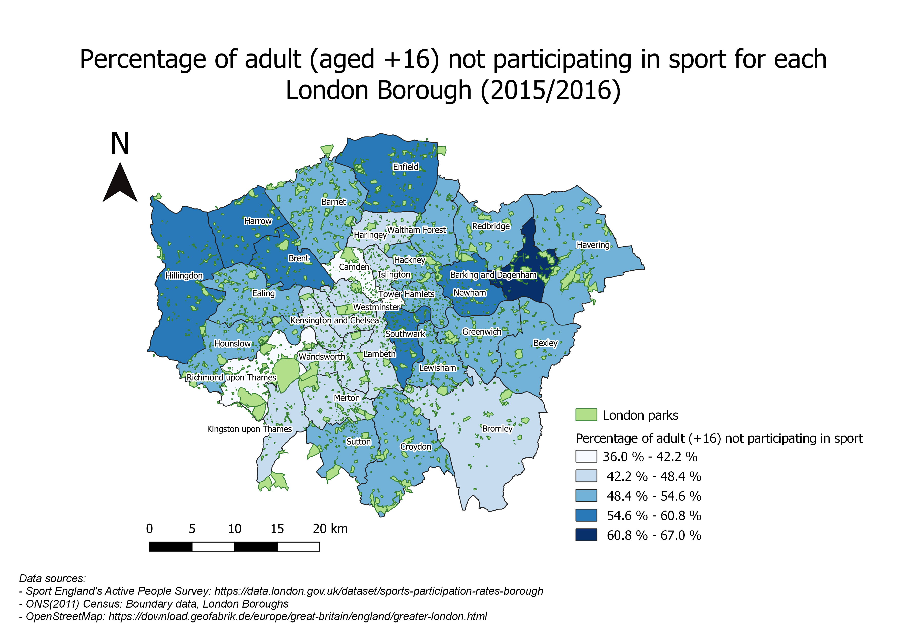

The following code will generate a map from the city of Zurich showing the birth rate for each city borough. The map also shows the public space in Zurich, these spaces varied from small to big park. 

First, the library which will be need to open the files and create the map are imported. Tydiverse to read and manipulate the dataset, tmap, tmaptools to create and visualize data distribution in maps, rgdal, geojsonio, maptools to open and manipulate geographic data. 

```{r}
library(tidyverse)
library(tmaptools)
library(sf)
library(tmap)
library(rgdal)
library(maptools)
library(geojsonio)
```

After this, the shapefile with boundaries for the district of Zurich and the dataframe with the information regarding birth rate are open. 
```{r}
ZurichMap <- st_read("stadtkreis/Stadtkreis.shp")
birth.rate <- read.csv("birth.rate.csv", header = TRUE, sep=",")
```

To quickly check if the data has been read correctly, the "class" function is used. This indicates that the Zurich boundary map is read as a simple feature object. 

```{r}
class(ZurichMap)
class(birth.rate)
```

Before to map the birth rate for each borough ("Kreis"), the dataframe need to be join with the shapefile. To know, the name of the attributes that are similar, the function head is used. This give the first six lines for each datasets. 

```{r}
head(ZurichMap)
head(birth.rate)
```

The attribute "knr" and "kreis" are both similar. The birth.rate dataframe will therefore be append to ZurichMap joining these two attributes. 

```{r}
ZurichBirthMap <- append_data(ZurichMap, birth.rate, key.shp="knr", key.data="kreis")
```
Now, the map can be plot. The function qtm is used to generate the map of Zurich. Once the layer with the boroughs of Zurich has been made, it is possible to add some other layers to personalized the map. Essential features such as a title, a compass, a scale bar can also be add as new layer.  

```{r}
tmap_mode("plot")
qtm(ZurichBirthMap)
```
```{r}
tm_shape(ZurichBirthMap)+
  tm_polygons("average.birth.rate",
              title="% Birth",
              breaks=c(9,10,11,12,13,14),
              palette="Blues",
              lwd=0.4,
              border.col="orange")+
  tm_layout(main.title="Average Birth rate in year 2017", main.title.size=1, main.title.position = c("center","top"), frame=FALSE, legend.frame = TRUE,legend.frame.lwd = 0.5, legend.outside=TRUE, legend.title.size = 0.8, legend.position = c("right","bottom"))+
  tm_compass(position = c("left","bottom"),type="8star",size=1.5)+
  tm_scale_bar(position = c("left","bottom"),size=0.4)
```
Now, we would like to see where there are some open spaces either small or big parks in Zurich city. 
The park geolocation can be direclty read from the web using the library geojson.

```{r}
park <- geojson_read("https://data.stadt-zuerich.ch/dataset/park/resource/570b4622-eb7a-4ad3-8b4f-028d30b6cb8c/download/park.json", what="sp")
```
Would it be possible to add the spatial park location to the map previously made? Let's try!
```{r}
qtm(park)
```
```{r}
tm_shape(ZurichBirthMap)+
  tm_polygons("average.birth.rate",
              title="% Birth",
              breaks=c(9,10,11,12,13,14),
              palette="Blues",
              lwd=0.4,
              border.col="orange")+
  tm_layout(main.title="Average Birth rate in year 2017", main.title.size=1, main.title.position = c("center","top"), frame=FALSE, legend.frame = TRUE,legend.frame.lwd = 0.5, legend.outside=TRUE, legend.title.size = 0.8, legend.position = c("right","bottom"))+
  tm_compass(position = c("left","bottom"),type="8star",size=1.5)+
  tm_scale_bar(position = c("left","bottom"),size=0.4)+
qtm(park)
```
What if, we want to select only the playgrounds? I would need to convert my json file into a dataframe, but I don't know how to do that. So let's import my park as a shapefile. 
```{r}
park.data <- st_read("park/Park.shp")
summary(park.data)
playground <- park.data[grep("Spielplatz", park.data$infrastruk),]
```
With summary(), I can see all the information that related to the park data. I notice that each parks have different attributes, for example some of them have a playground, coffee or/and wc facilities. I want to select only the park with a playground. 
Let's check quickly, if the data have now fewer dots (parks)!
```{r}
qtm(playground)
```

```{r}
tm_shape(ZurichBirthMap)+
  tm_polygons("average.birth.rate",
              title="% Birth",
              breaks=c(9,10,11,12,13,14),
              palette="Blues",
              lwd=0.4,
              border.col="orange")+
  tm_layout(main.title="Average Birth rate in year 2017", main.title.size=1, main.title.position = c("center","top"), frame=FALSE, legend.frame = TRUE,legend.frame.lwd = 0.5, legend.outside=TRUE, legend.title.size = 0.8, legend.position = c("right","bottom"))+
  tm_compass(position = c("left","bottom"),type="8star",size=1.5)+
  tm_scale_bar(position = c("left","bottom"),size=0.4)+
qtm(playground,symbols.col ="limegreen", symbols.size=0.1)
```

Just because it is fancy, here is an interactive the map in an interactive way. The function tmap_mode() is now set as "view" in contrast to "plot". 

```{r}
tmap_mode("view")
tm_shape(ZurichBirthMap)+
  tm_polygons("average.birth.rate",
              title="% Birth",
              breaks=c(9,10,11,12,13,14),
              palette="Blues",
              alpha = 0.5,
              lwd=0.4,
              border.col="orange")+
  tm_layout(main.title="Average Birth rate in year 2017", main.title.size=1, main.title.position = c("center","top"), frame=FALSE, legend.frame = TRUE,legend.frame.lwd = 0.5, legend.outside=TRUE, legend.title.size = 0.8, legend.position = c("right","bottom"))+
  tm_compass(position = c("left","bottom"),type="8star",size=1.5)+
  tm_scale_bar(position = c("left","bottom"),size=0.4)+
qtm(playground,symbols.col ="limegreen", symbols.size=0.3)
```

Attach to this document is the firt part of the exercise of doing a map. This map was done by using QGIS. Instead of mapping the birth rate in Zurich, I have chosen to map the sport participation for each London Borough and also add a layer for the park. The shapefile for the park in London contains the geography feature of the park, instead of dot, the surface area of each park is shown. 
Unfortunately, I could not reproduce a similar map for Zurich because I could not find the statistical data regarding the sport participation for each borough but also the surface area and geometry for each park. My two maps are therefore different. And these represent one main limitation in mapping, namely the availability of open data!  

```{r}

```